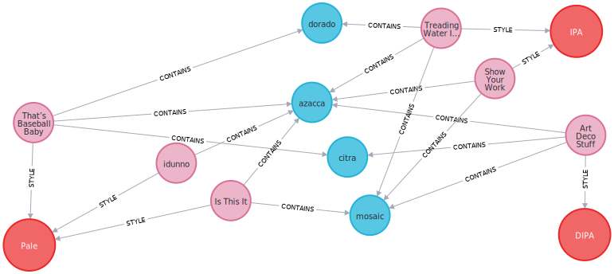
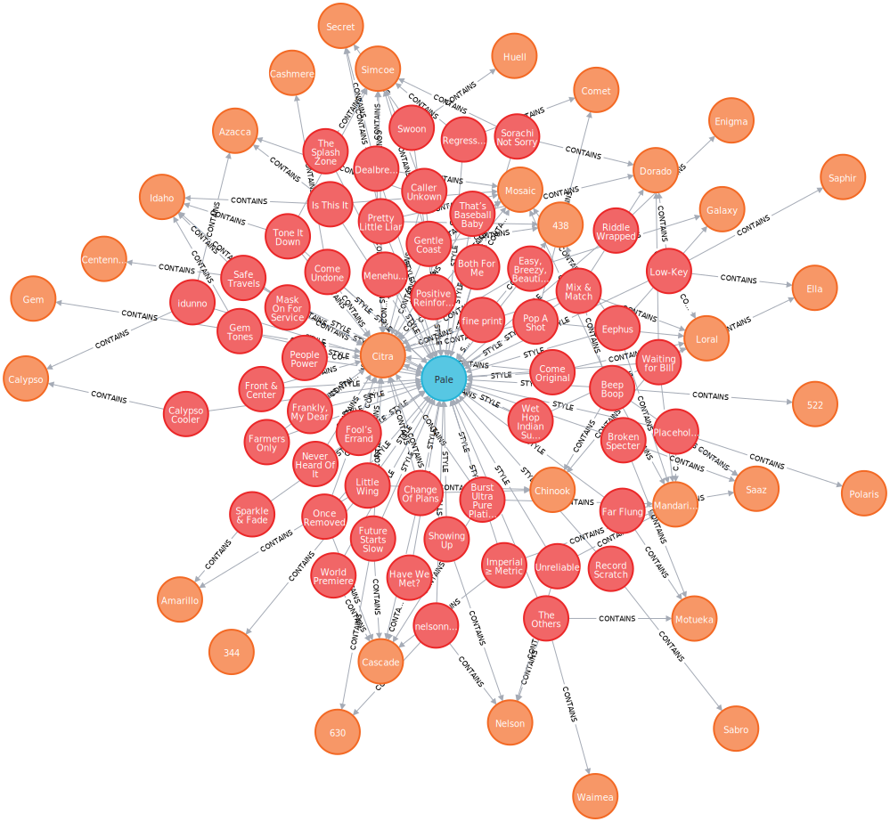

# Cloudburst Hop Graph

Web-scraping [Cloudburst Brewing's](https://cloudburstbrew.com/) beer descriptions to create a Neo4j graph database showing relationships between various beers and hop varietals.



Additional examples are shown below in the [example queries](#example-db-queries) and [Neo4j Bloom](#neo4j-bloom) sections.

## Installation

This project requires Neo4j and for best search features Neo4j Bloom, which are populated via some python ETL scripts from files in the `data` folder.  These files are produced by [scrapers](#web-scrapers) whose scripts are included in the `scrapers` subfolder for those who wish to update the data files.

Most users can install Neo4j and Bloom by installing Neo4j Desktop for Windows or Mac.  A sample docker script for setup of Neo4j is provided in `start_neo4j.sh`, but without an enterprise server license you will not be abnle to install Bloom and use the enterprise grade interface, but can still run queries in the [console](#example-db-queries).

The scripts assume an environmental variable for the database password is set as:
```
export NEO4J_PW="yourpassword"
```
with the default user `neo4j`, and that the ports are still set to the defaults for the console of 7474, and bolt database driver on 7678.  

The database can be populated by running
```
python3 config_neo4j_indexes.py
```
to configure indexes once, and then loaded with

```
python3 load_neo4j.py
```


## Example DB Queries

I provide here some Neo4j cypher queries as examples to help those not familiar with Neo4j's [query language syntax](https://neo4j.com/developer/cypher/).

### Beers containing a hop (and their styles)

I claim these are among the most delicious.

```js
match p = (h:Hop)-[]-(b:Beer)-[]-(s:Style)
where h.name = 'Azacca'
return p
```


### All beers of a particular style and their hop graph

```js
match p = (h:Hop)-[]-(b:Beer)-[]-(s:Style)
where s.style = 'Pale'
return p
```


###  Beers with most unique hops

Neo4j query language supports json aggregations.  This example returns two beers with the largest numbers of found distinct hops as a single record containing the results aggregated as a json object.

```js
match (b:Beer)
with b.name as name,
    b.hops as hops, 
    b.description as description,
    size(b.hops) as num_hops
    order by num_hops DESC LIMIT 2
return collect({name : name, hops : hops, num_hops : num_hops, description : description }) as beers
```

```json
{
  "beers": [
    {
      "num_hops": 7,
      "name": "Alternative Facts IPA",
      "description": "No need for statistics, scientific research, data analysis, unbiased surveys/polls, experts in their field, or REALITY - your opinion is good enough for us! About this beer? We used 1.5 million pounds of Chinook, 522, Citra, Cascade, Amarillo, Mandarina, and Centennial hops - all of the best hops. The very best. Nobody builds better IPAs than us, it’s gonna be great, it’s gonna be YUGE…Fuuuuuuuck.",
      "hops": [
        "522",
        "Amarillo",
        "Cascade",
        "Centennial",
        "Chinook",
        "Citra",
        "Mandarina"
      ]
    },
    {
      "num_hops": 7,
      "name": "Rainfall IPA",
      "description": "Our friends from Portland, OR came up and things. Got. Juicy! We started with a base of PIlsner Malt, White Wheat, and Oats, added a whirlpool addition of Mosaic, Citra & Galaxy, and followed it up with  a massive dry-hop of Galaxy, Enigma, Vic Secret, Motueka, & Ella. The end result is a soft, balanced tropical downpour of haze!",
      "hops": [
        "Citra",
        "Ella",
        "Enigma",
        "Galaxy",
        "Mosaic",
        "Motueka",
        "Secret"
      ]
    }
  ]
}
```

###  Largest ABV beers

```js
match (b:Beer)
with b order by b.abv DESC limit 3
return collect({name : b.name, abv : b.abv, style : b.style}) as beers
```

```json
{
  "beers": [
    {
      "abv": 13.8,
      "name": "Barrel Aged Darkenfloxx",
      "style": "Fancy Beer"
    },
    {
      "abv": 11.9,
      "name": "Old Tubthumper",
      "style": "Fancy Beer"
    },
    {
      "abv": 11.8,
      "name": "Ixnay on the Islay",
      "style": "Fancy Beer"
    }
  ]
}
```

### Most frequent hop pairings

Find the most frequent hop pairings and alphabetized list of beer names containing said pairing

```js
match p = (a:Hop)-[]-(b:Beer)-[]-(c:Hop)
where a.name < c.name
with a,b,c order by b.name
with a.name as hop1, c.name as hop2, count(b) as freq, collect(b.name) as beer_list order by freq DESC limit 3
return collect({freq:freq, hop_pair : hop1 +' '+hop2, beer_list:beer_list}) as hop_pairs
```

This returns the following json (beer lists shown are truncated to fit better in this document).

```json
{
  "hop_pairs": [
    {
      "hop_pair": "Citra Mosaic",
      "freq": 51,
      "beer_list": [
        "A Whole New World",
        "Almost There IPA",
        "Art Deco Stuff",
        ...
      ]
    },
    {
      "hop_pair": "Citra Simcoe",
      "freq": 32,
      "beer_list": [
        "Brontosaurus Supernova",
        "Business or Pleasure? IPA",
        "Caller Unkown",
        ...
      ]
    },
    {
      "hop_pair": "Chinook Citra",
      "freq": 23,
      "beer_list": [
        "Alternative Facts IPA",
        "Change Of Plans",
        "Deadly Melody",
        ...
      ]
    }
  ]
}
```

## Neo4j Bloom

Neo4j Bloom is an enterprise UI that can run with locally on Neo4j Desktop for a single user (or Neo4j Enterprise if you're willing to pay for a server license for sharing with other users).  Sorry Neo4j Community users.  Bloom allows for the wrapping cypher queries with more human-usable phrases such as `find beers containing hop named Azacca` into something more akin to a dashboard that they call a database perspective.  I have exported a copy of my [bloom perspective](../neo4j-bloom-perspective/cloudburst-beer-graph.json) here that should be importable into Bloom via their GUI.

Example pictures are forthcoming.

##  Web Scrapers

The web scraping code has now been moved to a subfolder organized as `scrapers/scraper_name`.  The project scrapes data from [Cloudburst](https://cloudburstbrew.com/) using curl then a python script using [Beautiful Soup](https://beautiful-soup-4.readthedocs.io/en/latest/).  This codepath is probably somewhat stable (until they redo their webpage).

The hop data from Yakima Chief is processed via a mixture of `pdftotext`, `python`, and `sed`.  The scrapers are provided for those who want to try running them, but expect that over time these to decay quickly and become quite buggy.  The chain of scripts produce intermediate files, but you should be able to march forward as the scripts are numbered sequentially in order of necessary execution.  Not sure how often the PDF is updated, or if the same scripts will be usable again.
